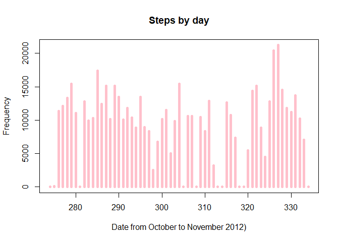
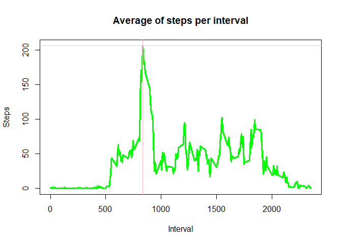
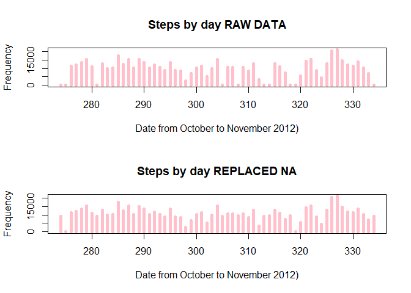
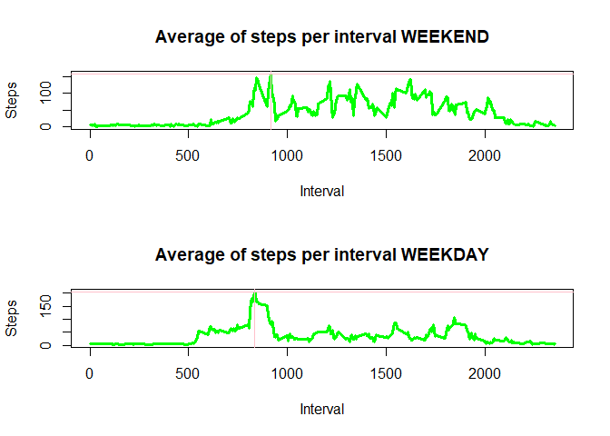

# Reproducible Research Project Description

This assignment makes use of data from a personal activity monitoring device. This device collects data at 5 minute intervals through out the day. The data consists of two months of data from an anonymous individual collected during the months of October and November, 2012 and include the number of steps taken in 5 minute intervals each day.

The data for this assignment can be downloaded from the course web site: [Dataset](https://d396qusza40orc.cloudfront.net/repdata%2Fdata%2Factivity.zip)

The variables included in this dataset are:

* **steps**: Number of steps taking in a 5-minute interval (missing values are coded as NA)
* **date**: The date on which the measurement was taken in YYYY-MM-DD format
* **interval**: Identifier for the 5-minute interval in which measurement was taken

The dataset is stored in a comma-separated-value (CSV) file and there are a total of 17,568 observations in this dataset.

## Download and read the dataset

First of all, we must download the data set and unzip it. This chunk of code performs these operations. 


```r
# Step0: Get the working directory
pwd <- getwd()

# Step1: Download the required dataset
url <- "https://d396qusza40orc.cloudfront.net/repdata%2Fdata%2Factivity.zip"
download.file(url, file.path(pwd, "DataPeerAssessment.zip"))

# Step2: Unzip the data
unzip(file.path(pwd, "DataPeerAssessment.zip"), overwrite = TRUE, exdir = ".")
```

After that, we have now in the work directory a file called activity.csv. So, now we gonna read it in R.


```r
df <- read.csv(file.path(pwd, "activity.csv"))
```

## Process/transform the data

At this point, we are going to change the date format (character 2 date), to be able to operate with the dates.


```r
df$date <- strptime(df$date, "%Y-%m-%d")
```

## What is mean total number of steps taken per day?

We are going to solve all the questions.

### Calculate the total number of steps taken per day

We make a split by dates of the number of steps. And for each day, we perform the sum opperation in order to obtain the total. Note: it's mandatory to remove the NAs!


```r
StepsByDate <- split(df$steps, df$date$yday)
TotalStepsByDate <- sapply(StepsByDate, sum, na.rm = TRUE)
```

Finally in this chunk, we generate a histogram of the total number of steps taken each day.


```r
plot(x = unique(df$date$yday), 
     y = TotalStepsByDate, 
     main = "Steps by day", 
     xlab = "Date from October to November 2012)", 
     ylab = "Frequency",
     type = "h",
     lwd = 5,
     col = "pink")
```

<!-- -->

And we create a table with the mean and the median of each date. Empty cells = NA values


```r
library(xtable)

resume <- data.frame(
    Current_Date = as.character(unique(df$date)),
    Mean_Value_Calculated = sapply(StepsByDate, mean, na.rm = TRUE),
    Median_Value_Calculated = sapply(StepsByDate, median, na.rm = TRUE)
)

print(xtable(resume),
      include.rownames = FALSE,
      type = "html")
```

<!-- html table generated in R 3.5.3 by xtable 1.8-4 package -->
<!-- Mon May 27 20:12:31 2019 -->
<table border=1>
<tr> <th> Current_Date </th> <th> Mean_Value_Calculated </th> <th> Median_Value_Calculated </th>  </tr>
  <tr> <td> 2012-10-01 </td> <td align="right">  </td> <td align="right">  </td> </tr>
  <tr> <td> 2012-10-02 </td> <td align="right"> 0.44 </td> <td align="right"> 0.00 </td> </tr>
  <tr> <td> 2012-10-03 </td> <td align="right"> 39.42 </td> <td align="right"> 0.00 </td> </tr>
  <tr> <td> 2012-10-04 </td> <td align="right"> 42.07 </td> <td align="right"> 0.00 </td> </tr>
  <tr> <td> 2012-10-05 </td> <td align="right"> 46.16 </td> <td align="right"> 0.00 </td> </tr>
  <tr> <td> 2012-10-06 </td> <td align="right"> 53.54 </td> <td align="right"> 0.00 </td> </tr>
  <tr> <td> 2012-10-07 </td> <td align="right"> 38.25 </td> <td align="right"> 0.00 </td> </tr>
  <tr> <td> 2012-10-08 </td> <td align="right">  </td> <td align="right">  </td> </tr>
  <tr> <td> 2012-10-09 </td> <td align="right"> 44.48 </td> <td align="right"> 0.00 </td> </tr>
  <tr> <td> 2012-10-10 </td> <td align="right"> 34.38 </td> <td align="right"> 0.00 </td> </tr>
  <tr> <td> 2012-10-11 </td> <td align="right"> 35.78 </td> <td align="right"> 0.00 </td> </tr>
  <tr> <td> 2012-10-12 </td> <td align="right"> 60.35 </td> <td align="right"> 0.00 </td> </tr>
  <tr> <td> 2012-10-13 </td> <td align="right"> 43.15 </td> <td align="right"> 0.00 </td> </tr>
  <tr> <td> 2012-10-14 </td> <td align="right"> 52.42 </td> <td align="right"> 0.00 </td> </tr>
  <tr> <td> 2012-10-15 </td> <td align="right"> 35.20 </td> <td align="right"> 0.00 </td> </tr>
  <tr> <td> 2012-10-16 </td> <td align="right"> 52.38 </td> <td align="right"> 0.00 </td> </tr>
  <tr> <td> 2012-10-17 </td> <td align="right"> 46.71 </td> <td align="right"> 0.00 </td> </tr>
  <tr> <td> 2012-10-18 </td> <td align="right"> 34.92 </td> <td align="right"> 0.00 </td> </tr>
  <tr> <td> 2012-10-19 </td> <td align="right"> 41.07 </td> <td align="right"> 0.00 </td> </tr>
  <tr> <td> 2012-10-20 </td> <td align="right"> 36.09 </td> <td align="right"> 0.00 </td> </tr>
  <tr> <td> 2012-10-21 </td> <td align="right"> 30.63 </td> <td align="right"> 0.00 </td> </tr>
  <tr> <td> 2012-10-22 </td> <td align="right"> 46.74 </td> <td align="right"> 0.00 </td> </tr>
  <tr> <td> 2012-10-23 </td> <td align="right"> 30.97 </td> <td align="right"> 0.00 </td> </tr>
  <tr> <td> 2012-10-24 </td> <td align="right"> 29.01 </td> <td align="right"> 0.00 </td> </tr>
  <tr> <td> 2012-10-25 </td> <td align="right"> 8.65 </td> <td align="right"> 0.00 </td> </tr>
  <tr> <td> 2012-10-26 </td> <td align="right"> 23.53 </td> <td align="right"> 0.00 </td> </tr>
  <tr> <td> 2012-10-27 </td> <td align="right"> 35.14 </td> <td align="right"> 0.00 </td> </tr>
  <tr> <td> 2012-10-28 </td> <td align="right"> 39.78 </td> <td align="right"> 0.00 </td> </tr>
  <tr> <td> 2012-10-29 </td> <td align="right"> 17.42 </td> <td align="right"> 0.00 </td> </tr>
  <tr> <td> 2012-10-30 </td> <td align="right"> 34.09 </td> <td align="right"> 0.00 </td> </tr>
  <tr> <td> 2012-10-31 </td> <td align="right"> 53.52 </td> <td align="right"> 0.00 </td> </tr>
  <tr> <td> 2012-11-01 </td> <td align="right">  </td> <td align="right">  </td> </tr>
  <tr> <td> 2012-11-02 </td> <td align="right"> 36.81 </td> <td align="right"> 0.00 </td> </tr>
  <tr> <td> 2012-11-03 </td> <td align="right"> 36.70 </td> <td align="right"> 0.00 </td> </tr>
  <tr> <td> 2012-11-04 </td> <td align="right">  </td> <td align="right">  </td> </tr>
  <tr> <td> 2012-11-05 </td> <td align="right"> 36.25 </td> <td align="right"> 0.00 </td> </tr>
  <tr> <td> 2012-11-06 </td> <td align="right"> 28.94 </td> <td align="right"> 0.00 </td> </tr>
  <tr> <td> 2012-11-07 </td> <td align="right"> 44.73 </td> <td align="right"> 0.00 </td> </tr>
  <tr> <td> 2012-11-08 </td> <td align="right"> 11.18 </td> <td align="right"> 0.00 </td> </tr>
  <tr> <td> 2012-11-09 </td> <td align="right">  </td> <td align="right">  </td> </tr>
  <tr> <td> 2012-11-10 </td> <td align="right">  </td> <td align="right">  </td> </tr>
  <tr> <td> 2012-11-11 </td> <td align="right"> 43.78 </td> <td align="right"> 0.00 </td> </tr>
  <tr> <td> 2012-11-12 </td> <td align="right"> 37.38 </td> <td align="right"> 0.00 </td> </tr>
  <tr> <td> 2012-11-13 </td> <td align="right"> 25.47 </td> <td align="right"> 0.00 </td> </tr>
  <tr> <td> 2012-11-14 </td> <td align="right">  </td> <td align="right">  </td> </tr>
  <tr> <td> 2012-11-15 </td> <td align="right"> 0.14 </td> <td align="right"> 0.00 </td> </tr>
  <tr> <td> 2012-11-16 </td> <td align="right"> 18.89 </td> <td align="right"> 0.00 </td> </tr>
  <tr> <td> 2012-11-17 </td> <td align="right"> 49.79 </td> <td align="right"> 0.00 </td> </tr>
  <tr> <td> 2012-11-18 </td> <td align="right"> 52.47 </td> <td align="right"> 0.00 </td> </tr>
  <tr> <td> 2012-11-19 </td> <td align="right"> 30.70 </td> <td align="right"> 0.00 </td> </tr>
  <tr> <td> 2012-11-20 </td> <td align="right"> 15.53 </td> <td align="right"> 0.00 </td> </tr>
  <tr> <td> 2012-11-21 </td> <td align="right"> 44.40 </td> <td align="right"> 0.00 </td> </tr>
  <tr> <td> 2012-11-22 </td> <td align="right"> 70.93 </td> <td align="right"> 0.00 </td> </tr>
  <tr> <td> 2012-11-23 </td> <td align="right"> 73.59 </td> <td align="right"> 0.00 </td> </tr>
  <tr> <td> 2012-11-24 </td> <td align="right"> 50.27 </td> <td align="right"> 0.00 </td> </tr>
  <tr> <td> 2012-11-25 </td> <td align="right"> 41.09 </td> <td align="right"> 0.00 </td> </tr>
  <tr> <td> 2012-11-26 </td> <td align="right"> 38.76 </td> <td align="right"> 0.00 </td> </tr>
  <tr> <td> 2012-11-27 </td> <td align="right"> 47.38 </td> <td align="right"> 0.00 </td> </tr>
  <tr> <td> 2012-11-28 </td> <td align="right"> 35.36 </td> <td align="right"> 0.00 </td> </tr>
  <tr> <td> 2012-11-29 </td> <td align="right"> 24.47 </td> <td align="right"> 0.00 </td> </tr>
  <tr> <td> 2012-11-30 </td> <td align="right">  </td> <td align="right">  </td> </tr>
   </table>


### What is the average daily activity pattern?

Now we should Make a time series plot (i.e. type="l") of the 5-minute interval (x-axis) and the average number of steps taken, averaged across all days (y-axis).  

So now, we make the split by interval instead by date. In that case, instead of the maximum we are looking for the average value.


```r
StepsPerInterval <- split(df$steps, df$interval)
AverageStepsPerInterval <- sapply(StepsPerInterval, mean, na.rm = TRUE)
```

Finally in this chunk, we generate a plot type "l" of the average number of steps per interval during the day. In the maximum point we are going to generate an abline.


```r
plot(unique(df$interval), 
     AverageStepsPerInterval, 
     type = "l",
     xlab = "Interval",
     ylab = "Steps",
     col = "green",
     lwd = 3,
     main = "Average of steps per interval")

maxpos <- unique(df$interval)[match(max(AverageStepsPerInterval), AverageStepsPerInterval)]
maxvalue <- max(AverageStepsPerInterval)

abline(h = maxvalue, col = "pink")
abline(v = maxpos, col = "pink")
```

<!-- -->

Like we can see in the figure, in the interval **835** we found the maximum value: **206.1698113**.  

### Imputing missing values

Note that there are a number of days/intervals where there are missing values (coded as NA). The presence of missing days may introduce bias into some calculations or summaries of the data.

We want to know the total number of NA in the database. So first of all, we obtain this value.


```r
numNA <- sum(as.numeric(!complete.cases(df$steps)))
```
The number of NAs is equal to **2304**. So now we are going to replace the NAs with the mean value for each day.


```r
df_raw <- df

# Mean value for day
MeanStepsPerDay <- sapply(StepsByDate, mean, na.rm = TRUE)
MeanStepsPerDay[is.nan(MeanStepsPerDay)] <- 0

# Repeat the mean value for each interval
MeanForInterval <- rep(MeanStepsPerDay, length(unique(df$interval)))

# Replace the NAs values on the df
NA_pos <- is.na(df$steps)
df$steps[NA_pos] <- MeanForInterval[NA_pos]
```

So, now let's compare!


```r
TotalStepsByDate_RAW <- TotalStepsByDate
StepsByDate_RAW <- StepsByDate

StepsByDate <- split(df$steps, df$date$yday)
TotalStepsByDate <- sapply(StepsByDate, sum, na.rm = TRUE)

par(mfcol = c(2, 1))

plot(x = unique(df$date$yday), 
     y = TotalStepsByDate_RAW, 
     main = "Steps by day RAW DATA", 
     xlab = "Date from October to November 2012)", 
     ylab = "Frequency",
     type = "h",
     lwd = 5,
     col = "pink")

plot(x = unique(df$date$yday), 
     y = TotalStepsByDate, 
     main = "Steps by day REPLACED NA", 
     xlab = "Date from October to November 2012)", 
     ylab = "Frequency",
     type = "h",
     lwd = 5,
     col = "pink")
```

<!-- -->

And now the mean and median!


```r
resume <- data.frame(
    Current_Date = as.character(unique(df$date)),
    Mean_RAW = sapply(StepsByDate_RAW, mean, na.rm = TRUE),
    Median_RAW = sapply(StepsByDate_RAW, median, na.rm = TRUE),
    Mean_Replaced = sapply(StepsByDate, mean, na.rm = TRUE),
    Median_Replaced = sapply(StepsByDate, median, na.rm = TRUE)
)

print(xtable(resume),
      include.rownames = FALSE,
      type = "html")
```

<!-- html table generated in R 3.5.3 by xtable 1.8-4 package -->
<!-- Mon May 27 20:13:46 2019 -->
<table border=1>
<tr> <th> Current_Date </th> <th> Mean_RAW </th> <th> Median_RAW </th> <th> Mean_Replaced </th> <th> Median_Replaced </th>  </tr>
  <tr> <td> 2012-10-01 </td> <td align="right">  </td> <td align="right">  </td> <td align="right"> 32.34 </td> <td align="right"> 36.09 </td> </tr>
  <tr> <td> 2012-10-02 </td> <td align="right"> 0.44 </td> <td align="right"> 0.00 </td> <td align="right"> 0.44 </td> <td align="right"> 0.00 </td> </tr>
  <tr> <td> 2012-10-03 </td> <td align="right"> 39.42 </td> <td align="right"> 0.00 </td> <td align="right"> 39.42 </td> <td align="right"> 0.00 </td> </tr>
  <tr> <td> 2012-10-04 </td> <td align="right"> 42.07 </td> <td align="right"> 0.00 </td> <td align="right"> 42.07 </td> <td align="right"> 0.00 </td> </tr>
  <tr> <td> 2012-10-05 </td> <td align="right"> 46.16 </td> <td align="right"> 0.00 </td> <td align="right"> 46.16 </td> <td align="right"> 0.00 </td> </tr>
  <tr> <td> 2012-10-06 </td> <td align="right"> 53.54 </td> <td align="right"> 0.00 </td> <td align="right"> 53.54 </td> <td align="right"> 0.00 </td> </tr>
  <tr> <td> 2012-10-07 </td> <td align="right"> 38.25 </td> <td align="right"> 0.00 </td> <td align="right"> 38.25 </td> <td align="right"> 0.00 </td> </tr>
  <tr> <td> 2012-10-08 </td> <td align="right">  </td> <td align="right">  </td> <td align="right"> 32.26 </td> <td align="right"> 36.09 </td> </tr>
  <tr> <td> 2012-10-09 </td> <td align="right"> 44.48 </td> <td align="right"> 0.00 </td> <td align="right"> 44.48 </td> <td align="right"> 0.00 </td> </tr>
  <tr> <td> 2012-10-10 </td> <td align="right"> 34.38 </td> <td align="right"> 0.00 </td> <td align="right"> 34.38 </td> <td align="right"> 0.00 </td> </tr>
  <tr> <td> 2012-10-11 </td> <td align="right"> 35.78 </td> <td align="right"> 0.00 </td> <td align="right"> 35.78 </td> <td align="right"> 0.00 </td> </tr>
  <tr> <td> 2012-10-12 </td> <td align="right"> 60.35 </td> <td align="right"> 0.00 </td> <td align="right"> 60.35 </td> <td align="right"> 0.00 </td> </tr>
  <tr> <td> 2012-10-13 </td> <td align="right"> 43.15 </td> <td align="right"> 0.00 </td> <td align="right"> 43.15 </td> <td align="right"> 0.00 </td> </tr>
  <tr> <td> 2012-10-14 </td> <td align="right"> 52.42 </td> <td align="right"> 0.00 </td> <td align="right"> 52.42 </td> <td align="right"> 0.00 </td> </tr>
  <tr> <td> 2012-10-15 </td> <td align="right"> 35.20 </td> <td align="right"> 0.00 </td> <td align="right"> 35.20 </td> <td align="right"> 0.00 </td> </tr>
  <tr> <td> 2012-10-16 </td> <td align="right"> 52.38 </td> <td align="right"> 0.00 </td> <td align="right"> 52.38 </td> <td align="right"> 0.00 </td> </tr>
  <tr> <td> 2012-10-17 </td> <td align="right"> 46.71 </td> <td align="right"> 0.00 </td> <td align="right"> 46.71 </td> <td align="right"> 0.00 </td> </tr>
  <tr> <td> 2012-10-18 </td> <td align="right"> 34.92 </td> <td align="right"> 0.00 </td> <td align="right"> 34.92 </td> <td align="right"> 0.00 </td> </tr>
  <tr> <td> 2012-10-19 </td> <td align="right"> 41.07 </td> <td align="right"> 0.00 </td> <td align="right"> 41.07 </td> <td align="right"> 0.00 </td> </tr>
  <tr> <td> 2012-10-20 </td> <td align="right"> 36.09 </td> <td align="right"> 0.00 </td> <td align="right"> 36.09 </td> <td align="right"> 0.00 </td> </tr>
  <tr> <td> 2012-10-21 </td> <td align="right"> 30.63 </td> <td align="right"> 0.00 </td> <td align="right"> 30.63 </td> <td align="right"> 0.00 </td> </tr>
  <tr> <td> 2012-10-22 </td> <td align="right"> 46.74 </td> <td align="right"> 0.00 </td> <td align="right"> 46.74 </td> <td align="right"> 0.00 </td> </tr>
  <tr> <td> 2012-10-23 </td> <td align="right"> 30.97 </td> <td align="right"> 0.00 </td> <td align="right"> 30.97 </td> <td align="right"> 0.00 </td> </tr>
  <tr> <td> 2012-10-24 </td> <td align="right"> 29.01 </td> <td align="right"> 0.00 </td> <td align="right"> 29.01 </td> <td align="right"> 0.00 </td> </tr>
  <tr> <td> 2012-10-25 </td> <td align="right"> 8.65 </td> <td align="right"> 0.00 </td> <td align="right"> 8.65 </td> <td align="right"> 0.00 </td> </tr>
  <tr> <td> 2012-10-26 </td> <td align="right"> 23.53 </td> <td align="right"> 0.00 </td> <td align="right"> 23.53 </td> <td align="right"> 0.00 </td> </tr>
  <tr> <td> 2012-10-27 </td> <td align="right"> 35.14 </td> <td align="right"> 0.00 </td> <td align="right"> 35.14 </td> <td align="right"> 0.00 </td> </tr>
  <tr> <td> 2012-10-28 </td> <td align="right"> 39.78 </td> <td align="right"> 0.00 </td> <td align="right"> 39.78 </td> <td align="right"> 0.00 </td> </tr>
  <tr> <td> 2012-10-29 </td> <td align="right"> 17.42 </td> <td align="right"> 0.00 </td> <td align="right"> 17.42 </td> <td align="right"> 0.00 </td> </tr>
  <tr> <td> 2012-10-30 </td> <td align="right"> 34.09 </td> <td align="right"> 0.00 </td> <td align="right"> 34.09 </td> <td align="right"> 0.00 </td> </tr>
  <tr> <td> 2012-10-31 </td> <td align="right"> 53.52 </td> <td align="right"> 0.00 </td> <td align="right"> 53.52 </td> <td align="right"> 0.00 </td> </tr>
  <tr> <td> 2012-11-01 </td> <td align="right">  </td> <td align="right">  </td> <td align="right"> 32.01 </td> <td align="right"> 35.94 </td> </tr>
  <tr> <td> 2012-11-02 </td> <td align="right"> 36.81 </td> <td align="right"> 0.00 </td> <td align="right"> 36.81 </td> <td align="right"> 0.00 </td> </tr>
  <tr> <td> 2012-11-03 </td> <td align="right"> 36.70 </td> <td align="right"> 0.00 </td> <td align="right"> 36.70 </td> <td align="right"> 0.00 </td> </tr>
  <tr> <td> 2012-11-04 </td> <td align="right">  </td> <td align="right">  </td> <td align="right"> 32.45 </td> <td align="right"> 36.17 </td> </tr>
  <tr> <td> 2012-11-05 </td> <td align="right"> 36.25 </td> <td align="right"> 0.00 </td> <td align="right"> 36.25 </td> <td align="right"> 0.00 </td> </tr>
  <tr> <td> 2012-11-06 </td> <td align="right"> 28.94 </td> <td align="right"> 0.00 </td> <td align="right"> 28.94 </td> <td align="right"> 0.00 </td> </tr>
  <tr> <td> 2012-11-07 </td> <td align="right"> 44.73 </td> <td align="right"> 0.00 </td> <td align="right"> 44.73 </td> <td align="right"> 0.00 </td> </tr>
  <tr> <td> 2012-11-08 </td> <td align="right"> 11.18 </td> <td align="right"> 0.00 </td> <td align="right"> 11.18 </td> <td align="right"> 0.00 </td> </tr>
  <tr> <td> 2012-11-09 </td> <td align="right">  </td> <td align="right">  </td> <td align="right"> 32.31 </td> <td align="right"> 35.94 </td> </tr>
  <tr> <td> 2012-11-10 </td> <td align="right">  </td> <td align="right">  </td> <td align="right"> 32.87 </td> <td align="right"> 36.09 </td> </tr>
  <tr> <td> 2012-11-11 </td> <td align="right"> 43.78 </td> <td align="right"> 0.00 </td> <td align="right"> 43.78 </td> <td align="right"> 0.00 </td> </tr>
  <tr> <td> 2012-11-12 </td> <td align="right"> 37.38 </td> <td align="right"> 0.00 </td> <td align="right"> 37.38 </td> <td align="right"> 0.00 </td> </tr>
  <tr> <td> 2012-11-13 </td> <td align="right"> 25.47 </td> <td align="right"> 0.00 </td> <td align="right"> 25.47 </td> <td align="right"> 0.00 </td> </tr>
  <tr> <td> 2012-11-14 </td> <td align="right">  </td> <td align="right">  </td> <td align="right"> 32.99 </td> <td align="right"> 36.09 </td> </tr>
  <tr> <td> 2012-11-15 </td> <td align="right"> 0.14 </td> <td align="right"> 0.00 </td> <td align="right"> 0.14 </td> <td align="right"> 0.00 </td> </tr>
  <tr> <td> 2012-11-16 </td> <td align="right"> 18.89 </td> <td align="right"> 0.00 </td> <td align="right"> 18.89 </td> <td align="right"> 0.00 </td> </tr>
  <tr> <td> 2012-11-17 </td> <td align="right"> 49.79 </td> <td align="right"> 0.00 </td> <td align="right"> 49.79 </td> <td align="right"> 0.00 </td> </tr>
  <tr> <td> 2012-11-18 </td> <td align="right"> 52.47 </td> <td align="right"> 0.00 </td> <td align="right"> 52.47 </td> <td align="right"> 0.00 </td> </tr>
  <tr> <td> 2012-11-19 </td> <td align="right"> 30.70 </td> <td align="right"> 0.00 </td> <td align="right"> 30.70 </td> <td align="right"> 0.00 </td> </tr>
  <tr> <td> 2012-11-20 </td> <td align="right"> 15.53 </td> <td align="right"> 0.00 </td> <td align="right"> 15.53 </td> <td align="right"> 0.00 </td> </tr>
  <tr> <td> 2012-11-21 </td> <td align="right"> 44.40 </td> <td align="right"> 0.00 </td> <td align="right"> 44.40 </td> <td align="right"> 0.00 </td> </tr>
  <tr> <td> 2012-11-22 </td> <td align="right"> 70.93 </td> <td align="right"> 0.00 </td> <td align="right"> 70.93 </td> <td align="right"> 0.00 </td> </tr>
  <tr> <td> 2012-11-23 </td> <td align="right"> 73.59 </td> <td align="right"> 0.00 </td> <td align="right"> 73.59 </td> <td align="right"> 0.00 </td> </tr>
  <tr> <td> 2012-11-24 </td> <td align="right"> 50.27 </td> <td align="right"> 0.00 </td> <td align="right"> 50.27 </td> <td align="right"> 0.00 </td> </tr>
  <tr> <td> 2012-11-25 </td> <td align="right"> 41.09 </td> <td align="right"> 0.00 </td> <td align="right"> 41.09 </td> <td align="right"> 0.00 </td> </tr>
  <tr> <td> 2012-11-26 </td> <td align="right"> 38.76 </td> <td align="right"> 0.00 </td> <td align="right"> 38.76 </td> <td align="right"> 0.00 </td> </tr>
  <tr> <td> 2012-11-27 </td> <td align="right"> 47.38 </td> <td align="right"> 0.00 </td> <td align="right"> 47.38 </td> <td align="right"> 0.00 </td> </tr>
  <tr> <td> 2012-11-28 </td> <td align="right"> 35.36 </td> <td align="right"> 0.00 </td> <td align="right"> 35.36 </td> <td align="right"> 0.00 </td> </tr>
  <tr> <td> 2012-11-29 </td> <td align="right"> 24.47 </td> <td align="right"> 0.00 </td> <td align="right"> 24.47 </td> <td align="right"> 0.00 </td> </tr>
  <tr> <td> 2012-11-30 </td> <td align="right">  </td> <td align="right">  </td> <td align="right"> 32.23 </td> <td align="right"> 35.94 </td> </tr>
   </table>


### Are there differences in activity patterns between weekdays and weekends?

So, lets see if there are any difference between the two groups using wday (see POSIXlt). We make two new data frames for each one.


```r
# Add the index of the week day 0 Sunday to 6 Saturday
df$weekday <- df$date$wday

# Function to labeled the two groups
labeled <- function(x){
    if((x > 0) & (x<6)){
        x <- factor("WEEKDAY")
    }
    else{
        x <- factor("WEEKEND")
    }
}

# Apply the funciton
df$weekday <- sapply(df$weekday, labeled)

# Split into two df
df_weekend <- df[df$weekday == "WEEKEND",]
df_weekday <- df[df$weekday == "WEEKDAY",]
```

And now, we should do a panel plot with the 5-minute interval (x-axis) and the average number of steps taken, averaged across all weekday days or weekend days (y-axis).


```r
StepsPerInterval_Weekend <- split(df_weekend$steps, df_weekend$interval)
AverageStepsPerInterval_Weekend <- sapply(StepsPerInterval_Weekend, mean, na.rm = TRUE)

StepsPerInterval_Weekday <- split(df_weekday$steps, df_weekday$interval)
AverageStepsPerInterval_Weekday <- sapply(StepsPerInterval_Weekday, mean, na.rm = TRUE)


par(mfcol = c(2, 1))

plot(unique(df_weekend$interval), 
     AverageStepsPerInterval_Weekend, 
     type = "l",
     xlab = "Interval",
     ylab = "Steps",
     col = "green",
     lwd = 3,
     main = "Average of steps per interval WEEKEND")

maxpos <- unique(df_weekend$interval)[match(max(AverageStepsPerInterval_Weekend), AverageStepsPerInterval_Weekend)]
maxvalue <- max(AverageStepsPerInterval_Weekend)

abline(h = maxvalue, col = "pink")
abline(v = maxpos, col = "pink")


plot(unique(df_weekday$interval), 
     AverageStepsPerInterval_Weekday, 
     type = "l",
     xlab = "Interval",
     ylab = "Steps",
     col = "green",
     lwd = 3,
     main = "Average of steps per interval WEEKDAY")

maxpos <- unique(df_weekday$interval)[match(max(AverageStepsPerInterval_Weekday), AverageStepsPerInterval_Weekday)]
maxvalue <- max(AverageStepsPerInterval_Weekday)

abline(h = maxvalue, col = "pink")
abline(v = maxpos, col = "pink")
```

<!-- -->
